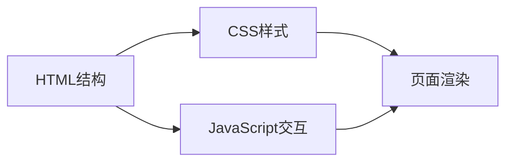

## 1. Architecture Design
纯前端应用，单页HTML + CSS + JavaScript



## 2. Technology Description
- Frontend: 原生 HTML5 + CSS3 + JavaScript (ES6+)
- 无后端，纯静态页面
- 使用 CSS 渐变、动画实现视觉效果
- 原生 JavaScript 实现页面切换逻辑

## 3. File Structure
```
.
├── index.html              # 主页面文件
└── .trae/documents/
    ├── prd.md             # 产品需求文档
    └── arch.md            # 技术架构文档
```

## 4. Core Implementation

### 4.1 Page Structure
使用全屏容器，每页占满视口高度，通过CSS类切换显示状态

### 4.2 Navigation
- 上一页/下一页按钮
- 键盘导航 (左右箭头)
- 页面指示器

### 4.3 Animations
- 页面切换时的淡入淡出动画
- 元素入场动画 (使用 animation-delay 实现 staggered effect)
- 悬停效果增强交互感
